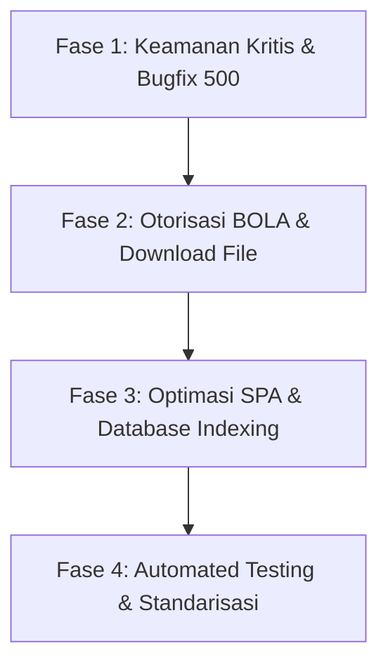

# LAPORAN AUDIT KODE & KEAMANAN SISTEM VERIFIKASI SOAL ASESMEN

**Target Sistem:** Aplikasi Web Verifikasi Soal Asesmen (Sidang KP)  
**Teknologi:** Laravel 11/12 (PHP 8.2), Inertia.js (React 19, Tailwind CSS v4), PostgreSQL  
**Tanggal Audit:** 19 Agustus 2026  
**Auditor:** Senior Software & Security Auditor  
**Status Kelayakan Produksi:** ❌ **NOT PRODUCTION-READY (FAILED)**

---

## DAFTAR ISI
1. [Ringkasan Eksekutif](#1-ringkasan-eksekutif)
2. [Matriks Distribusi Temuan](#2-matriks-distribusi-temuan)
3. [Temuan Audit per Kategori (10 Area)](#3-temuan-audit-per-kategori)
   - [Area 1: Struktur & Arsitektur](#area-1-struktur--arsitektur)
   - [Area 2: Frontend & Client Experience](#area-2-frontend--client-experience)
   - [Area 3: Backend, API & Business Logic](#area-3-backend-api--business-logic)
   - [Area 4: Database & Integritas Skema](#area-4-database--integritas-skema)
   - [Area 5: Autentikasi, Sesi & Otorisasi](#area-5-autentikasi-sesi--otorisasi)
   - [Area 6: Keamanan Aplikasi (OWASP Top 10)](#area-6-keamanan-aplikasi-owasp-top-10)
   - [Area 7: Performa & Efisiensi Resource](#area-7-performa--efisiensi-resource)
   - [Area 8: Error Handling & Logging](#area-8-error-handling--logging)
   - [Area 9: Cakupan Pengujian (Testing)](#area-9-cakupan-pengujian-testing)
   - [Area 10: Konsistensi Fungsional & Logika Bisnis](#area-10-konsistensi-fungsional--logika-bisnis)
4. [Daftar Fitur/Flow yang Belum Memiliki Test](#4-daftar-fiturflow-yang-belum-memiliki-test)
5. [Quick Wins (Perbaikan Cepat Dampak Besar)](#5-quick-wins)
6. [Rencana Aksi & Prioritas Perbaikan](#6-rencana-aksi--prioritas-perbaikan)

---

## 1. RINGKASAN EKSEKUTIF

Audit komprehensif telah dilakukan terhadap seluruh codebase sistem verifikasi soal asesmen. Sistem memiliki arsitektur modular yang membagi fungsionalitas berdasarkan 3 peran utama: **Super Admin**, **Dosen Koordinator**, dan **Dosen Verifikator**, dilengkapi dengan pencatatan audit log terpusat dan relasi kurikulum (PLO & CLO).

Meskipun fondasi fungsional telah terbentuk, hasil audit menemukan **sejumlah cacat fatal (Critical & High Defects)** yang berpotensi melumpuhkan sistem di tahap produksi, merusak integritas data, serta membocorkan naskah soal ujian resmi:

1. **Broken Object-Level Authorization (BOLA / IDOR):** Dosen Verifikator dapat menyetujui, menolak, atau mengunduh naskah soal mata kuliah lain yang bukan merupakan penugasannya.
2. **Runtime Crash Error (SQL Exception):** Query controller mengeksekusi filter terhadap kolom yang tidak ada pada database (`verified_by` pada tabel `soal`), menimbulkan HTTP 500 saat membuka detail kelompok verifikasi.
3. **Hardcoded Password Lemah pada Auto-Provisioning:** Akun dosen baru dibuat otomatis dengan password bawaan `'password'` tanpa flow aktivasi atau paksaan pergantian password.
4. **Degradasi Performa SPA:** Navigasi menu sidebar merender tag HTML biasa `<a>`, menyebabkan *hard page reload* di setiap klik menu dan mematikan keunggulan Inertia.js SPA.
5. **Ketiadaan Rate Limiting:** Endpoint sensitif (Login, Upload Soal, Verifikasi) tidak memiliki throttling.

---

## 2. MATRIKS DISTRIBUSI TEMUAN

| Kategori Audit | Critical | High | Medium | Low | Total |
| :--- | :---: | :---: | :---: | :---: | :---: |
| 1. Struktur & Arsitektur | 0 | 1 | 2 | 0 | **3** |
| 2. Frontend | 0 | 1 | 2 | 1 | **4** |
| 3. Backend / API | 2 | 1 | 1 | 0 | **4** |
| 4. Database | 0 | 1 | 2 | 0 | **3** |
| 5. Autentikasi & Otorisasi | 1 | 1 | 1 | 0 | **3** |
| 6. Keamanan (Security) | 2 | 1 | 0 | 0 | **3** |
| 7. Performa | 0 | 0 | 1 | 1 | **2** |
| 8. Error Handling & Logging | 0 | 0 | 1 | 1 | **2** |
| 9. Testing | 1 | 0 | 0 | 0 | **1** |
| 10. Konsistensi Fungsional | 0 | 2 | 1 | 1 | **4** |
| **TOTAL** | **6** | **8** | **11** | **4** | **29** |

---

## 3. TEMUAN AUDIT PER KATEGORI

### AREA 1: STRUKTUR & ARSITEKTUR

#### [SEVERITY: HIGH] 1.1 Kredensial Database, Secret Key & Mode Debug Aktif di Repository
- **Lokasi:** `backend/.env`, `backend/config/app.php:29-43`
- **Deskripsi:** File `.env` aktif ter-commit ke dalam repositori dengan nilai `APP_DEBUG=true`, `APP_KEY` statis, dan username/password PostgreSQL lokal (`postgres / admin123`). Selain itu terdapat file `database/database.sqlite` yang tidak terpakai tetapi tetap tersimpan.
- **Dampak:** Jika source code bocor atau ter-deploy tanpa override environment, penyerang dapat membaca konfigurasi sensitif, memalsukan session token via APP_KEY, dan membaca stack trace error internal.
- **Rekomendasi:** 
  1. Hapus `.env` dari version control dan tambahkan ke `.gitignore`.
  2. Pastikan file `.env.example` hanya berisi template tanpa kredensial asli.
  3. Generate `APP_KEY` baru di server staging/production.

#### [SEVERITY: MEDIUM] 1.2 File Sampah (Stray / Orphaned Files) di Root Frontend dan Backend
- **Lokasi:**
  - `frontend/getNameWithReadWriteType()`
  - `frontend/isUniqueConstraintError($e)`
  - `frontend/php`
  - `frontend/prepareBindings($bindings)`
  - `backend/test_import.php`
  - `backend/test_pdo.php`
  - `backend/test_plo_import.php`
  - `backend/database/seeders/MatkulSeeder.php` (duplikat dari `MataKuliahSeeder.php`)
- **Deskripsi:** Terdapat file-file sisa eksperimen/debug lokal yang tidak sengaja ter-generate ke folder project.
- **Dampak:** Mengotori workspace, membingungkan proses build CI/CD, dan berisiko mengekspos endpoint pengujian jika terbawa ke production.
- **Rekomendasi:** Hapus seluruh file tersebut dan rapikan struktur folder.

---

### AREA 2: FRONTEND & CLIENT EXPERIENCE

#### [SEVERITY: HIGH] 2.1 Navigasi Sidebar Menggunakan Anchor Tag Standar `<a>` Melumpuhkan Inertia SPA
- **Lokasi:** `frontend/src/Layouts/AuthenticatedLayout.jsx:84-97`
- **Deskripsi:** Komponen navigasi internal merender `<a href={item.href}>` alih-alih komponen `<Link href={item.href}>` dari `@inertiajs/react`.
- **Bukti Kode:**
  ```jsx
  function NavLink({ item }) {
      const Icon = item.icon;
      const active = isPathActive(item.href);
      return (
          <a href={item.href} className={`...`}>
              <Icon className="..." />
              <span>{item.label}</span>
          </a>
      );
  }
  ```
- **Dampak:** Setiap kali pengguna mengklik menu sidebar, browser mengeksekusi *hard page reload* (mengunduh ulang bundle JS/CSS dan me-reset state client). Hal ini mematikan efisiensi Single Page Application (SPA).
- **Rekomendasi:** Ganti elemen `<a>` dengan `<Link>` dari `@inertiajs/react`.

#### [SEVERITY: MEDIUM] 2.2 Flash Message & State Conflict pada Async Notification Action
- **Lokasi:** `backend/app/Http/Controllers/NotificationController.php:18, 27`
- **Deskripsi:** Endpoint `read` dan `readAll` notifikasi mengembalikan `redirect()->back()`. Ketika dipanggil via async action di UI, redirect ini memicu partial reload yang dapat menimpa status flash message (`success` / `error`) dari form yang sedang dikerjakan user.
- **Dampak:** Notifikasi toast di antarmuka pengguna dapat hilang seketika atau muncul secara tidak wajar.
- **Rekomendasi:** Gunakan Inertia `preserveScroll: true` dan `preserveState: true` saat interaksi notifikasi, atau kembalikan response JSON.

---

### AREA 3: BACKEND, API & BUSINESS LOGIC

#### [SEVERITY: CRITICAL] 3.1 Fatal Database Exception Akibat Kolom Fiktif `verified_by` pada Model `Soal`
- **Lokasi:** `backend/app/Http/Controllers/SuperAdmin/KelompokVerifikasiController.php:349-358`
- **Deskripsi:** Method `show` pada Kelompok Verifikasi menjalankan query:
  ```php
  $verifiedCount = Soal::where('verified_by', $kv->dosen_id)
      ->where('periode_id', $periodeId)
      ->count();
  ```
  Tabel `soal` tidak memiliki kolom `verified_by`. Hubungan verifikasi dicatat di tabel `verifikasi` dengan foreign key `verifikator_id` merujuk ke tabel `users`.
- **Dampak:** Membuka detail kelompok verifikasi (`/superadmin/kelompok-verifikasi/{id}`) akan melempar PostgreSQL error: `SQLSTATE[42703]: Undefined column: 7 ERROR: column "verified_by" does not exist`, menghasilkan **HTTP 500 Internal Server Error**.
- **Rekomendasi:** Ubah query agregasi menggunakan relasi model `Verifikasi`:
  ```php
  $verifiedCount = \App\Models\Verifikasi::where('verifikator_id', $kv->dosen?->user_id)
      ->whereHas('soal', fn($q) => $q->where('periode_id', $periodeId))
      ->count();
  ```

#### [SEVERITY: CRITICAL] 3.2 Broken Object-Level Authorization (BOLA / IDOR) pada Verifikasi Soal
- **Lokasi:** `backend/app/Http/Controllers/Verifikator/VerifikasiController.php:14-35`
- **Deskripsi:** Method `store()` hanya memeriksa status soal (`canBeVerified()`), tetapi **tidak memvalidasi apakah dosen verifikator yang login memiliki surat penugasan aktif untuk mata kuliah dan periode soal tersebut**.
- **Bukti Kode:**
  ```php
  public function store(Request $request, Soal $soal)
  {
      $user = $request->user();
      if (!$soal->canBeVerified()) {
          return redirect()->back()->with('error', 'Soal ini tidak dapat diverifikasi pada status saat ini.');
      }
      // TIDAK ADA PENGECEKAN PENUGASAN VERIFIKATOR TERHADAP MATA KULIAH!
      $validated = $request->validate([
          'action'  => ['required', 'in:APPROVED,REVISION,REJECTED'],
          'catatan' => ['nullable', 'string', 'max:2000'],
      ]);
      ...
  ```
- **Dampak:** Verifikator dari Program Studi atau Mata Kuliah manapun dapat menyetujui, meminta revisi, atau menolak naskah soal mata kuliah lain cukup dengan mengirimkan request HTTP POST ke `/verifikator/soal/{soal_id}/verifikasi`.
- **Rekomendasi:** Wajib tambahkan pengecekan penugasan:
  ```php
  $isAssigned = PenugasanVerifikator::where('dosen_id', $user->dosen?->id)
      ->where('mata_kuliah_id', $soal->mata_kuliah_id)
      ->where('periode_id', $soal->periode_id)
      ->where('status', 'ACTIVE')
      ->exists();

  if (!$isAssigned) {
      abort(403, 'Anda tidak memiliki penugasan verifikasi untuk mata kuliah ini.');
  }
  ```

#### [SEVERITY: HIGH] 3.3 Race Condition pada Penomoran Surat Berita Acara Verifikasi (BAP)
- **Lokasi:** `backend/app/Http/Controllers/Verifikator/BeritaAcaraController.php:195-200`
- **Deskripsi:** Penomoran BAP dihitung dengan `BeritaAcara::where('periode_id', $periode->id)->count() + 1`.
- **Dampak:** Apabila dua verifikator mencetak BAP pada waktu yang bersamaan, kedua dokumen akan memiliki nomor surat yang sama (duplikasi nomor dokumen resmi).
- **Rekomendasi:** Gunakan PostgreSQL Sequence atau database locking `lockForUpdate()` dalam database transaction.

---

### AREA 4: DATABASE & INTEGRITAS SKEMA

#### [SEVERITY: HIGH] 4.1 Logika Destruktif `forceDelete()` pada Database Seeder
- **Lokasi:** `backend/database/seeders/MataKuliahSeeder.php:101-112`
- **Deskripsi:** Seeder mata kuliah mengeksekusi `forceDelete()` pada relasi operasional:
  ```php
  $mksToDelete = MataKuliah::withTrashed()->whereNotIn('kode_mk', $seededCodes)->get();
  foreach ($mksToDelete as $mk) {
      $mk->soal()->forceDelete();
      $mk->penugasanKoordinator()->forceDelete();
      $mk->penugasanVerifikator()->forceDelete();
      $mk->beritaAcara()->forceDelete();
      $mk->forceDelete();
  }
  ```
- **Dampak:** Jika seeder dijalankan di database yang telah berisi data operasional (misal saat pembaruan master data di server produksi), seluruh riwayat soal ujian dan BAP mata kuliah lama akan terhapus secara permanen (*permanent data loss*).
- **Rekomendasi:** Hapus logika `forceDelete()`. Gunakan update status `status = 'INACTIVE'` atau soft delete standar.

#### [SEVERITY: MEDIUM] 4.2 Ketiadaan Indexing pada Foreign Key & Kolom Filter Status
- **Lokasi:** `backend/database/migrations/2026_01_01_000020_create_operational_tables.php`
- **Deskripsi:** Kolom pencarian dan filtering utama (`soal.status`, `soal.mata_kuliah_id`, `soal.periode_id`, `audit_logs.model_type`, `audit_logs.model_id`) belum memiliki index eksplisit.
- **Dampak:** Penurunan performa database query (*Full Table Scan*) seiring bertambahnya transaksi soal dan log audit.
- **Rekomendasi:** Tambahkan composite index pada migration database.

---

### AREA 5: AUTENTIKASI, SESI & OTORISASI

#### [SEVERITY: CRITICAL] 5.1 Auto-Provisioning Akun dengan Default Password Lemah Tanpa Force Reset
- **Lokasi:** 
  - `backend/app/Http/Controllers/Auth/LoginController.php:41-58`
  - `backend/app/Http/Controllers/SuperAdmin/DosenController.php:77-87`
- **Deskripsi:** Saat dosen pertama kali login atau saat Super Admin membuat dosen dengan opsi `create_user`, sistem meng-generate akun dengan password bawaan `Hash::make('password')`. Sistem tidak menyediakan fitur ganti password ataupun memblokir akses sebelum password diganti.
- **Dampak:** Penyerang yang mengetahui Kode Dosen atau Email Dosen dapat langsung login menggunakan password default `'password'` dan memanipulasi naskah ujian.
- **Rekomendasi:** Integrasikan sistem dengan Single Sign-On (SSO) Telkom University (SAML/OAuth2) atau kirimkan email tautan aktivasi dengan one-time secure token.

#### [SEVERITY: HIGH] 5.2 Role Overwrite & Deadlock Akses pada Multi-Penugasan Dosen
- **Lokasi:** `backend/app/Http/Controllers/SuperAdmin/DosenController.php:213-219`
- **Deskripsi:** Kolom `users.role` bersifat string skalar tunggal. Saat pencabutan penugasan:
  ```php
  if ($remainingKoor > 0) {
      $dosen->user->update(['role' => 'KOORDINATOR']);
  } elseif ($remainingVerif > 0) {
      $dosen->user->update(['role' => 'VERIFIKATOR']);
  } else {
      $dosen->user->update(['role' => 'DOSEN']); // DEADLOCK: Role 'DOSEN' tidak diizinkan masuk route manapun!
  }
  ```
- **Dampak:** Dosen yang seluruh penugasannya dicabut akan memiliki role `DOSEN` dan mengalami HTTP 403 Forbidden di semua route aplikasi karena tidak ada rute untuk role tersebut.
- **Rekomendasi:** Buat route dashboard umum bagi dosen tanpa penugasan aktif atau arahkan ke halaman tunggu penugasan.

---

### AREA 6: KEAMANAN APLIKASI (OWASP TOP 10)

#### [SEVERITY: CRITICAL] 6.1 Ketiadaan Rate Limiting pada Login dan Upload File
- **Lokasi:** `backend/routes/web.php:21-25, 95-105`
- **Deskripsi:** Route `POST /login`, `POST /koordinator/soal`, dan `POST /superadmin/plo/import` tidak memiliki throttling middleware.
- **Dampak:** Rentan terhadap serangan *brute force credential stuffing* pada form login dan serangan *Denial of Service (DoS)* dengan membanjiri upload dokumen besar (20MB/file).
- **Rekomendasi:** Terapkan rate limiter:
  ```php
  Route::post('/login', [LoginController::class, 'login'])->middleware('throttle:5,1');
  Route::post('/koordinator/soal', [...])->middleware('throttle:20,1');
  ```

#### [SEVERITY: CRITICAL] 6.2 Akses Unduh File Naskah Ujian Tanpa Hak Otorisasi (IDOR File Download)
- **Lokasi:** 
  - `backend/app/Http/Controllers/Verifikator/SoalController.php:55-61`
  - `backend/app/Http/Controllers/Koordinator/RevisiController.php:61-68`
- **Deskripsi:** Endpoint download naskah soal dan download revisi hanya memeriksa keberadaan fisik file di storage, tanpa memeriksa apakah user yang mendownload adalah dosen yang berhak atas mata kuliah tersebut.
- **Dampak:** Potensi kebocoran seluruh naskah ujian kampus (*exam paper leak*) jika attacker memanggil URL download dengan ID file lain.
- **Rekomendasi:** Tambahkan verifikasi kepemilikan dan hak penugasan sebelum mengeksekusi `Storage::download()`.

#### [SEVERITY: HIGH] 6.3 Pseudo-DOCX Menggunakan Raw HTML Berbahaya untuk Kompatibilitas Office
- **Lokasi:** `backend/app/Http/Controllers/Koordinator/SoalGeneratorController.php:161-167`
- **Deskripsi:** Fitur download DOCX lembar soal merender view HTML mentah lalu mengirimkannya dengan header `application/vnd.ms-word` dan ekstensi `.doc`.
- **Dampak:** Microsoft Word modern memblokir atau memunculkan peringatan keamanan *"The file format and extension don't match. The file could be corrupted or unsafe."* saat dibuka dosen.
- **Rekomendasi:** Gunakan library `phpoffice/phpword` untuk menghasilkan berkas OpenXML DOCX yang valid dan terstandarisasi.

---

### AREA 7: PERFORMA & EFISIENSI RESOURCE

#### [SEVERITY: MEDIUM] 7.1 N+1 Query pada Perhitungan Tren Statistik Super Admin Dashboard
- **Lokasi:** `backend/app/Http/Controllers/SuperAdmin/DashboardController.php:59-86`
- **Deskripsi:** Dashboard Super Admin melakukan loop 7 hari ke belakang dengan 3 query terpisah per hari (total 21 query database berurutan di setiap request halaman utama).
- **Dampak:** Peningkatan beban CPU database dan latensi load halaman dashboard.
- **Rekomendasi:** Ubah menjadi satu kali query agregasi dengan `GROUP BY DATE(created_at)`.

---

### AREA 8: ERROR HANDLING & LOGGING

#### [SEVERITY: MEDIUM] 8.1 Hardcoded Nama & Gelar Ketua Program Studi (KaProdi)
- **Lokasi:** `backend/app/Http/Controllers/Verifikator/BeritaAcaraController.php:152`
- **Deskripsi:** Nilai nama pejabat KaProdi di-hardcode dalam kode:
  ```php
  'kaProdi' => 'Qilbaaini Effendi Muftikhali, S.Kom., M.Kom.',
  ```
- **Dampak:** Setiap pergantian pejabat program studi mengharuskan modifikasi source code dan deployment ulang aplikasi.
- **Rekomendasi:** Buat tabel `system_settings` atau master data Program Studi yang dapat dikelola Super Admin.

---

### AREA 9: CAKUPAN PENGUJIAN (TESTING)

#### [SEVERITY: CRITICAL] 9.1 Test Coverage Sangat Rendah (< 10%)
- **Lokasi:** `backend/tests/`
- **Deskripsi:** Hanya terdapat 1 file Feature Test (`KelompokVerifikasiTest.php`). Seluruh modul utama lainnya (Autentikasi, Soal Lifecycle, Review Workflow, BAP Generation, Import Excel) **sama sekali tidak memiliki automated test**.
- **Dampak:** Risiko tinggi terjadinya regresi bug saat penambahan fitur baru di masa mendatang.
- **Rekomendasi:** Buat automated test suite komprehensif menggunakan PHPUnit/Pest.

---

### AREA 10: KONSISTENSI FUNGSIONAL & LOGIKA BISNIS

#### [SEVERITY: HIGH] 10.1 Side-Effect Perubahan Status Data pada HTTP GET Request
- **Lokasi:** `backend/app/Http/Controllers/Verifikator/SoalController.php:46-48`
- **Deskripsi:** Saat Verifikator membuka halaman detail soal (`GET /verifikator/soal/{id}`), status soal langsung dimutasi menjadi `IN_REVIEW` di database.
- **Dampak:** Melanggar standar idempotensi HTTP GET. Prefetching browser atau kunjungan sekilas tanpa review akan mengunci status soal dan memblokir Koordinator untuk memperbarui naskah.
- **Rekomendasi:** Ubah status `IN_REVIEW` hanya melalui aksi tombol eksplisit ("Mulai Verifikasi") via HTTP POST.

---

## 4. DAFTAR FITUR/FLOW YANG BELUM MEMILIKI TEST

Modul-modul berikut belum memiliki automated test dan wajib dibuatkan skenario uji:

1. **Modul Autentikasi:**
   - Login dengan kombinasi Email/Kode Dosen + Password valid/invalid.
   - Penolakan login akun status `INACTIVE`.
   - Rate limiting throttle pada brute force login.
2. **Modul Penugasan & Kelompok Verifikasi:**
   - Validasi batas maksimal koordinator (3) dan verifikator (5) per MK.
   - Penolakan dosen yang ditugaskan sebagai koordinator sekaligus verifikator di mata kuliah yang sama.
   - Sinkronisasi role user saat aktivasi dan penonaktifan kelompok.
3. **Modul Manajemen Soal:**
   - Upload file non-dokumen (misal `.exe`, `.php`) wajib ditolak.
   - Upload soal di luar jadwal deadline periode aktif wajib ditolak.
   - Penomoran versi revisi bertingkat (v1, v2, v3).
   - Penghapusan soal non-DRAFT wajib ditolak.
4. **Modul Verifikasi & BAP:**
   - Otorisasi penugasan verifikator terhadap soal (BOLA prevention).
   - Pembuatan PDF Berita Acara dan validasi syarat seluruh soal telah berstatus `APPROVED`.

---

## 5. QUICK WINS

Langkah perbaikan cepat (< 2 jam) dengan dampak stabilitas dan keamanan instan:

| No | Tindakan | File Target | Dampak |
| :---: | :--- | :--- | :--- |
| 1 | Perbaiki query `verified_by` yang tidak ada | `SuperAdmin/KelompokVerifikasiController.php:349` | Mencegah HTTP 500 error |
| 2 | Ganti tag `<a>` menjadi `<Link>` Inertia | `frontend/src/Layouts/AuthenticatedLayout.jsx:84` | Mengembalikan performa SPA |
| 3 | Pasang middleware `throttle:5,1` di login | `backend/routes/web.php:22` | Mencegah Brute Force |
| 4 | Tambahkan auth check pada download soal & revisi | `Verifikator/SoalController.php`, `Koordinator/RevisiController.php` | Mencegah kebocoran naskah ujian |
| 5 | Hapus file sampah / artefak scratch | Folder `frontend/` dan `backend/` | Membersihkan codebase |

---

## 6. RENCANA AKSI & PRIORITAS PERBAIKAN



### Urutan Pengerjaan Berdasarkan Risiko:

1. **Fase 1: Keamanan & Integritas Data (Mendesak / Hari 1)**
   - Perbaiki bug SQL `verified_by` pada `KelompokVerifikasiController`.
   - Pasang validasi hak akses penugasan pada `VerifikasiController::store`.
   - Pasang middleware rate limiting pada route login dan upload.
   - Hapus `forceDelete()` destruktif pada `MataKuliahSeeder`.

2. **Fase 2: Proteksi File & Otorisasi Lengkap (Hari 2)**
   - Kunci endpoint download soal dan download revisi dengan policy check.
   - Perbaiki mekanisme ganti password dosen / alur aktivasi akun.
   - Perbaiki mutasi status `IN_REVIEW` dari HTTP GET ke POST.

3. **Fase 3: UX Frontend & Optimasi Database (Hari 3-4)**
   - Konversi seluruh navigasi sidebar menjadi Inertia `<Link>`.
   - Buat migration penambahan index foreign key pada tabel operasional.
   - Ganti generator pseudo-DOCX dengan PHPWord native.
   - Pindahkan nama KaProdi ke tabel pengaturan sistem.

4. **Fase 4: Test Suite & Dokumentasi (Hari 5)**
   - Tulis Unit & Feature Tests untuk Auth, Upload Soal, dan Verifikasi.
   - Bersihkan file-file artefak dan rapikan `.gitignore`.

---
*Laporan ini disusun berdasarkan audit kode aktual pada repositori sidangkp.*
