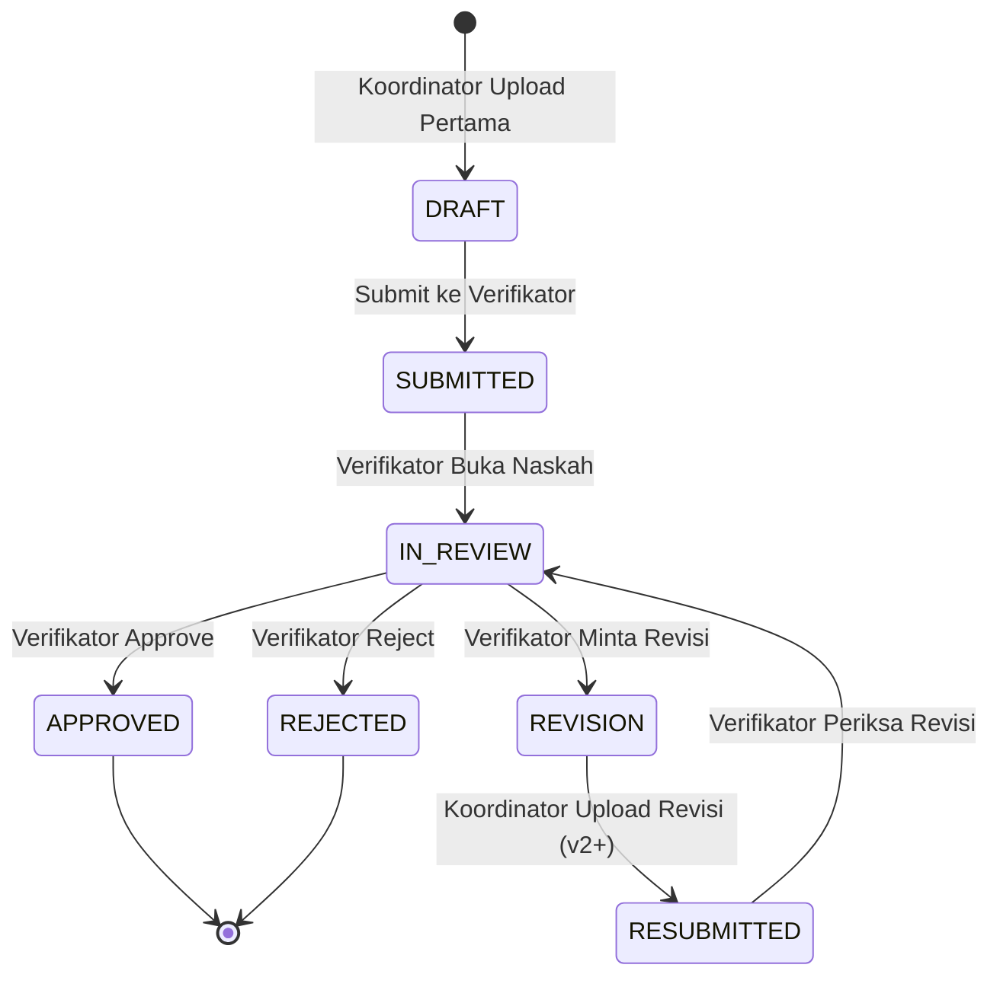

# Product Requirement Document (PRD)
**Sistem Informasi Verifikasi Soal Asesmen (Telkom University)**

- **Versi:** 2.0 (Updated September 2026)
- **Status:** Complete / Production-Ready
- **Platform:** Web Application (SPA via Inertia.js)
- **Backend:** Laravel 11/12 (PHP 8.2)
- **Frontend:** Inertia.js + React 19 + Tailwind CSS v4 + Vite
- **Database:** PostgreSQL (Primary), SQLite (Testing)
- **UI Aesthetic:** Telkom University Red & White Theme (`#801720`), Clean, Modern, Professional, Responsive
- **Testing:** PHPUnit / Laravel Test Suite (33 Passed, 138 Assertions)

---

## 1. Ringkasan Produk

Sistem Informasi Verifikasi Soal Asesmen adalah aplikasi berbasis web yang dibangun untuk mengelola dan memdigitalisasi seluruh rantai proses pengunggahan, pemetaan PLO/CLO, penugasan, verifikasi, revisi, pemantauan status, dan penerbitan Berita Acara (BAP) soal ujian/asesmen secara terstruktur dan terakreditasi.

Sistem mendukung tiga role utama:
1. **Super Admin**: Mengelola master data akademik, periode verifikasi, penugasan kelompok verifikasi (Koordinator & Verifikator), audit log, serta laporan eksekutif.
2. **Koordinator MK / Dosen MK**: Mengonfigurasi pemetaan PLO & CLO, mengunduh template lembar soal resmi (PDF/DOC), mengunggah naskah soal final, dan melakukan unggah revisi bertahap sesuai catatan verifikator.
3. **Dosen Verifikator**: Memeriksa naskah soal, memberikan penilaian per-CLO dan catatan umum, serta menetapkan keputusan (*Approved*, *Revision*, *Rejected*).

Seluruh alur kerja dibatasi secara ketat oleh **Periode Verifikasi** aktif dan prinsip **Separation of Duties** (seorang dosen tidak boleh memverifikasi mata kuliah yang ditugaskan kepadanya sebagai koordinator pada periode yang sama).

---

## 2. Tujuan Produk & Manfaat Bisnis

### 2.1 Tujuan Utama
- **Digitalisasi End-to-End**: Mengalihkan proses verifikasi soal fisik/manual ke platform terpusat.
- **Standarisasi OBE (Outcome-Based Education)**: Memastikan setiap soal ujian terpetakan secara presisi ke *Program Learning Outcomes* (PLO) dan *Course Learning Outcomes* (CLO) dengan total bobot LO tepat 100% per PLO.
- **Transparansi & Akuntabilitas**: Menyediakan riwayat revisi bertingkat (*versioning*) dan pencatatan audit log lengkap untuk setiap aksi penting.
- **Otomatisasi Dokumen**: Menghasilkan *Template Lembar Soal* (.pdf/.doc) dan *Berita Acara Verifikasi Soal* (.pdf) secara instan.

### 2.2 Manfaat Bisnis
- Mengeliminasi duplikasi pengarsipan dan risiko naskah soal bocor/hilang.
- Mempercepat siklus peninjauan soal jelang UTS/UAS.
- Mempermudah audit mutu akademik fakultas/program studi melalui ekspor data Excel & PDF.

---

## 3. Scope Produk

### 3.1 In Scope (Fitur Utama yang Berfungsi 100%)
- **Authentication & Authorization**: Login, logout, session management, proteksi role server-side, serta pergantian password.
- **Master Data Management**:
  - Dosen (NIP, Kode Dosen, Email, Nama, Status, Reset Password).
  - Mata Kuliah (Kode MK, Nama MK, SKS, Relasi PLO & CLO).
  - PLO & CLO (Deskripsi, Pivot Table, Import Excel dengan Preview & Konfirmasi, Export Excel).
  - Kategori Soal (UTS, UAS, Quiz, Tugas Besar, dll).
  - Periode Verifikasi (Status ACTIVE/CLOSED, Deadline Upload, Integrasi Tahun Ajaran).
- **Kelompok Verifikasi (Penugasan Terpadu)**: Penunjukan Koordinator MK & Dosen Verifikator per Mata Kuliah dan Periode dengan validasi *Separation of Duties*.
- **Generator & Pemetaan Soal**:
  - Pemetaan PLO & CLO dinamis.
  - Validasi total bobot LO = 100% per PLO.
  - Input pertanyaan per-CLO.
  - Pengelolaan Petunjuk Pengerjaan Ujian (tambah/edit/hapus butir petunjuk).
  - Ekspor Template Soal BAP (.pdf dan .doc).
- **Pengunggahan & Revisi Soal**:
  - Upload naskah soal final (PDF, DOC, DOCX maks 20 MB).
  - Penyimpanan aman di disk `private` (bukan public webroot).
  - Upload revisi bertingkat (v1, v2, v3...) tanpa menimpa file lama.
- **Workflow Verifikasi**:
  - Penilaian Verifikator: *Approved*, *Perlu Revisi*, *Rejected*.
  - Catatan evaluasi umum dan catatan per-CLO wajib diisi.
  - Notifikasi internal otomatis saat soal dikirim/direvisi/diverifikasi.
- **Berita Acara Verifikasi (BAP)**:
  - Rekapitulasi status soal per Mata Kuliah & Periode.
  - Generasi PDF Berita Acara resmi lengkap dengan logo instansi dan ringkasan statistik.
- **Audit & Monitoring**:
  - Dashboard statistik real-time per Role (Super Admin, Koordinator, Verifikator).
  - Monitoring progress verifikasi.
  - System Audit Log (pencatatan user, action, IP, old/new payload).

### 3.2 Out of Scope
- Aplikasi native mobile (iOS/Android) — fokus pada Responsive Web.
- Integrasi SSO Kampus OAuth2/SAML (saat ini menggunakan sistem Auth lokal Laravel).
- Sistem pelaksanaan ujian online (*CBT / Online Exam*).
- Generator soal otomatis berbantuan AI.

---

## 4. User Roles & Hak Akses

| Role | Deskripsi | Hak Akses Utama | Akun Seed Development |
| --- | --- | --- | --- |
| **Super Admin** | Pengelola utama sistem & admin akademik | Master Data, Periode, Penugasan Kelompok Verifikasi, Audit Log, Rekap Laporan, Reset Password Dosen. | `admin@telkomuniversity.ac.id` |
| **Koordinator MK** | Dosen penanggung jawab mata kuliah | Mengisi pemetaan PLO/CLO, mengunduh template, mengunggah naskah soal final, mengunggah revisi naskah soal. | `dosenmk@telkomuniversity.ac.id` |
| **Dosen Verifikator** | Dosen pemeriksa & penilai naskah soal | Meninjau naskah soal, memberikan feedback per-CLO, menetapkan status verifikasi, melihat Berita Acara. | `dosenverif@telkomuniversity.ac.id` |

---

## 5. Workflow State Machine Soal

---

## 6. Spesifikasi Arsitektur & Teknologi (Current Tech Stack)

### 6.1 Backend (Laravel)
- **Framework**: Laravel 11/12 (PHP 8.2+)
- **Architecture**: Controller-Service-Model Pattern, Form Request Validation, Policy/Middleware Authorization (`CheckRole`).
- **PDF Generation**: DomPDF (`barryvdh/laravel-dompdf`).
- **File Storage**: Storage disk `private` untuk berkas naskah soal guna mencegah akses publik tanpa otorisasi.

### 6.2 Frontend (React & Inertia.js)
- **Adapter**: Inertia.js React Adapter.
- **UI Library**: React 19, Tailwind CSS v4.
- **Icons**: Lucide React.
- **Alerts & Modals**: SweetAlert2 (`Utils/sweetalert.js`).
- **Build Tool**: Vite v8+.

### 6.3 Database (PostgreSQL & SQLite)
- **Primary DB**: PostgreSQL dengan UUID primary keys (`gen_random_uuid()`) dan JSONB columns (`plo_clo_data`, `clo_feedback`, `old_values`, `new_values`).
- **Database Constraints**: Multi-column unique indexes & PostgreSQL triggers untuk mencegah konflik penugasan *Separation of Duties*.
- **Testing DB**: SQLite in-memory untuk eksekusi unit test super cepat (33 tests pass).

---

## 7. Aturan Bisnis Kritikal (Business Rules)

1. **Separation of Duties**: Dosen yang ditugaskan sebagai Koordinator MK pada suatu periode **TIDAK BOLEH** ditugaskan sebagai Verifikator pada Mata Kuliah dan Periode yang sama.
2. **Bobot LO Must Equal 100%**: Total bobot LO untuk setiap PLO yang terpetakan dalam soal wajib berjumlah tepat **100%**.
3. **Penyimpanan Berkas Revisi**: Setiap perbaikan naskah soal menambah versi baru (`v1`, `v2`, `v3`) pada tabel `revisi_soal`. File lama **tidak boleh ditimpa atau dihapus**.
4. **Validasi Akses Berkas (Private Storage)**: Endpoint download dan preview naskah soal/revisi wajib memeriksa hak akses server-side (pemilik soal, koordinator terdaftar, verifikator terdaftar, atau superadmin).
5. **Kunci Periode Verifikasi**: Jika `PeriodeVerifikasi` berstatus `CLOSED` atau tanggal `deadline_upload` terlampaui, pengunggahan soal baru maupun revisi otomatis diblokir oleh sistem.

---

## 8. Status Implementasi & Verifikasi Kualitas

Seluruh modul dan kriteria penerimaan (*Acceptance Criteria*) telah selesai diimplementasikan dan diverifikasi:
- **Unit & Integration Tests**: 33 Test Cases (138 Assertions) **PASSED 100%**.
- **Build Verification**: `npm run build` dan compilation Vite sukses 0 error.
- **Codebase Cleanliness**: Duplikasi kode backend/frontend telah dikonsolidasi per Laporan Audit 2 September 2026.
